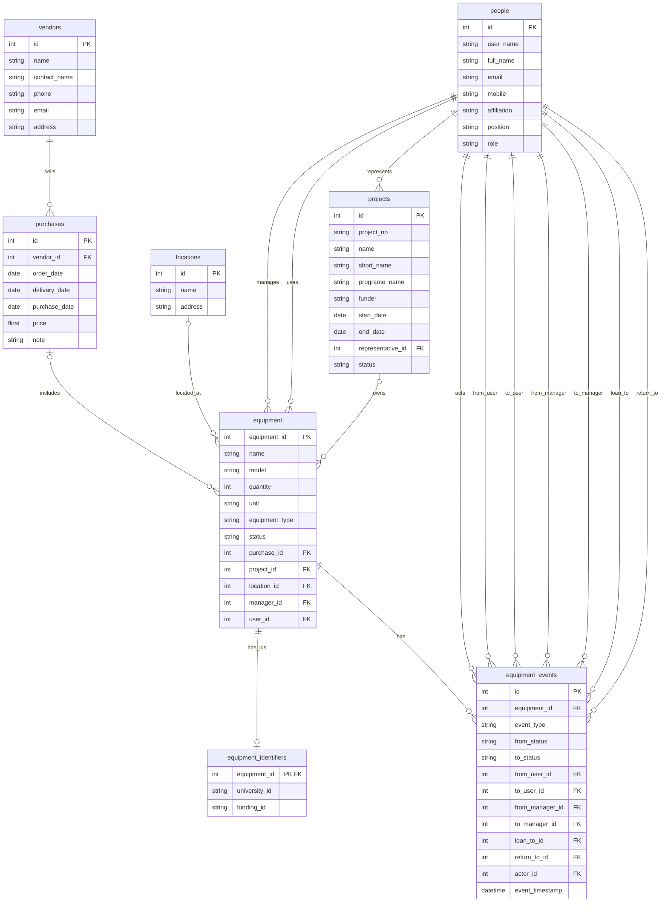

# ER図ドキュメント

## 目的
本ドキュメントは、機器管理データベースのエンティティ・リレーションシップ図（ER図）を示し、各テーブルの構造と関係性、及び主要な制約条件を明確にすることを目的としています。これにより、データベース設計の理解と開発・運用の基盤を提供します。

## ER図（Mermaid記法）

## エンティティ一覧と主な制約・業務ルール

- **equipment（機器）**
  - `equipment_id`：主キー。機器番号は自動生成、NOT NULL、UNIQUE。
  - `name`：名称（NOT NULL）。
  - `model`：型番（任意）。
  - `quantity`：数量（NOT NULL、既定=1）。消耗品は「箱/ロット」単位を許容。
  - `unit`：量詞（例：台 / 個 / 箱 / 本 / セット など、任意）。
  - `equipment_type`：`consumable` / `equipment` / `asset` のいずれか。
  - `status`：`in_stock`, `in_service`, `assigned`, `loaned`, `broken`, `repairing`, `returned_to_funder`, `discarded`。
  - `purchase_id`：購入情報（purchases）への外部キー（任意）。
  - `project_id`：プロジェクト（projects）への外部キー（任意）。配備（設置・稼働開始）時に設定する。
  - `location_id`：設置場所（locations）への外部キー（任意）。配備（設置・稼働開始）時に設定する。
  - `manager_id` / `user_id`：people への外部キー（任意）。運用開始後に設定される想定。

- **people（人）**
  - `id`：主キー。
  - `user_name`：ユーザー名（ログインID相当、任意）。
  - `full_name`：氏名（NOT NULL）。
  - `email`：メール（任意、重複を避けたい場合は UNIQUE を検討）。
  - `mobile`：携帯電話（任意）。
  - `affiliation`：所属（例：研究室/学科/企業名など）。
  - `position`：職位（例：教授/助教/学生/研究員など）。
  - `role`：`admin` / `member` / `viewer` / `guest`。
  - 貸出先や返却先として `guest` も許容（ただし操作権限は原則付与しない）。

- **projects（プロジェクト）**
  - `id`：主キー。
  - `project_no`：プロジェクト番号（学内/資金元の管理番号等、任意）。
  - `name`：プロジェクト名称（例：研究課題名）。
  - `short_name`：略称（任意）。
  - `programe_name`：事業名。
  - `funder`：資金元。
  - `start_date` / `end_date`：開始日 / 終了日。
  - `representative_id`：代表（people への外部キー）。
  - `status`：`ongoing` / `terminated` のいずれか。
  - 1つの project は 0件以上の equipment を所有（配備後に紐づく想定）。

- **locations（設置場所）**
  - `id`：主キー。
  - `name`：場所名称。
  - `address`：場所住所（任意）。
  - 1つの location は 0件以上の equipment を保持（配備後に紐づく想定）。

- **vendors（ベンダー）**
  - `id`：主キー。
  - `name`：ベンダー名称。
  - `contact_name`：担当者名（任意）。
  - `phone`：電話番号（任意）。
  - `email`：メールアドレス（任意）。
  - `address`：住所（任意）。
  - 1つの vendor は 0件以上の purchases を持つ。

- **purchases（購入）**
  - `id`：主キー。
  - `vendor_id`：vendors への外部キー。
  - `order_date` / `delivery_date` / `purchase_date`：発注日 / 納品日 / 購入日。
  - `price`：価格。
  - `note`：備考。
  - equipment は 0 または 1 つの purchase に紐づく（購入情報が不明な場合を許容）。

- **equipment_identifiers（機器識別子）**
  - `equipment_id`：主キー兼外部キー（equipment への参照）。
  - `university_id`：学内管理番号（固定資産番号/備品番号など、任意）。
  - `funding_id`：資金元管理番号（科研費番号など、任意）。
  - 1つの equipment に対して 0または1レコード（番号がない機器も許容）。
  - `university_id` や `funding_id` は重複を避けたい場合、UNIQUE 制約を検討する（物理設計で決定）。

- **equipment_events（機器イベント履歴）**
  - 機器の状態変更や貸出・返却などの履歴を統合管理。
  - `equipment_id`：対象機器（equipment への外部キー）。
  - `event_type`, `from_status`, `to_status`, `from_user_id`, `to_user_id`, `from_manager_id`, `to_manager_id`, `loan_to_id`, `return_to_id`, `actor_id`, `event_timestamp` を持つ。
  - `actor_id` は必須。その他のユーザー・マネージャー関連はイベント種別に応じて任意。

- **業務ルール**
  - `discarded` および `returned_to_funder` は終端状態（以降の運用操作は原則不可）。
  - 配備（設置・稼働開始）時に `project_id` / `location_id` を設定し、必要に応じて `manager_id` を設定する。
  - 貸出は `loaned` への遷移として記録し、返却先に応じて `in_stock` / `assigned` / `in_service` / `returned_to_funder` に遷移する。
  - 更新系操作の実行者（actor）は `admin` / `member` のみを想定し、履歴（equipment_events）に必ず記録する。

## 補足
詳細な物理設計（ENUM型の扱い、参照テーブルの有無、インデックス設計など）は `docs/05_physical_design.md` にて定義しています。
