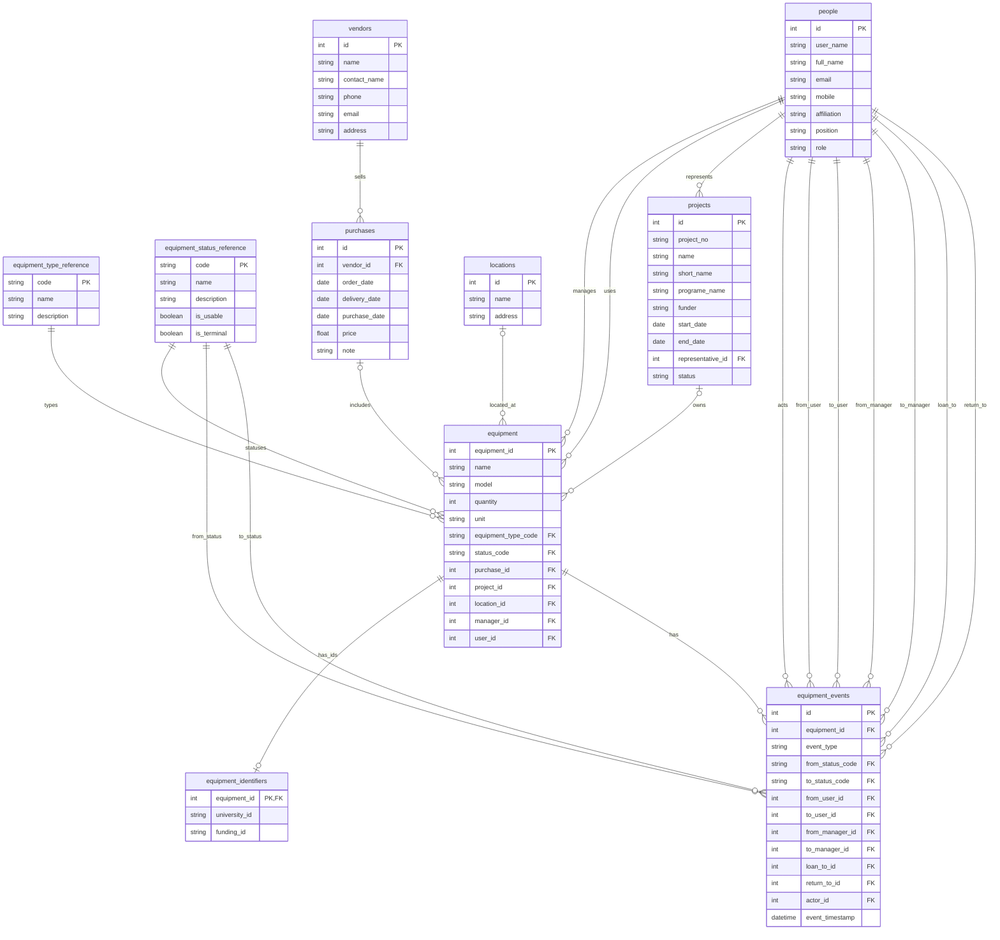

# 04 Logical Design（論理設計）

## 1. 目的
本ドキュメントでは、`docs/03_er_diagram.md` で確定した概念設計（ER図）をもとに、
リレーショナルデータベースとして実装可能な形へ落とし込むための**論理設計**を行う。

本章では、**第一正規形（1NF）〜第三正規形（3NF）** の観点で設計を確認・整理する。

---

## 2. 正規化の方針

### 2.1 対象テーブル
概念設計で定義した以下のテーブルを対象とする。

- equipment
- people
- projects
- locations
- vendors
- purchases
- equipment_identifiers
- equipment_events
- equipment_type_reference
- equipment_status_reference

### 2.2 第一正規形（1NF）の定義
第一正規形（1NF）とは、以下を満たす状態を指す。

- 各列は **原子値**（1セルに1値）のみを保持する
- 繰り返し項目（配列・リスト・可変長属性）を持たない
- 各行は主キーによって一意に識別できる

---

## 3. 第一正規形（1NF）の確認

### 3.1 1NFチェック観点
- 複数の値を1列に格納しない（例：メールアドレスを `a@x, b@y` のように保存しない）
- `xxx1`, `xxx2` のような列の繰り返しを作らない
- 意味の異なる情報を1列に混在させない

---

### 3.2 テーブル別 1NF 確認

#### equipment（機器）
- **主キー**：`equipment_id`
- 確認内容：
  - `name`（名称）、`model`（型番）、`quantity`（数量）、`unit`（量詞）は原子値 → OK
  - `equipment_type_code`、`status_code` は単一参照（マスタ参照） → OK
  - `project_id`、`location_id`、`manager_id`、`user_id` は単一参照 → OK
- 備考：
  - 消耗品は「箱」「ロット」単位で管理し、数量×量詞で表現する

#### people（人）
- **主キー**：`id`
- 確認内容：
  - `user_name`、`full_name`、`email`、`mobile`、`affiliation`、`position`、`role` はすべて原子値 → OK
- 備考：
  - 将来、複数メール・複数電話番号を管理する場合は別テーブル化を検討する

#### projects（プロジェクト）
- **主キー**：`id`
- 確認内容：
  - `project_no`、`name`、`short_name`、`programe_name`、`funder` は原子値 → OK
  - `start_date`、`end_date` は単一日付 → OK
  - `representative_id` は単一参照 → OK
  - `status` は単一状態値（`ongoing` / `terminated`） → OK

#### locations（設置場所）
- **主キー**：`id`
- 確認内容：
  - `name`、`address` は原子値 → OK
- 備考：
  - 建物・階・部屋単位での検索が必要になった場合は分割を検討する

#### vendors（ベンダー）
- **主キー**：`id`
- 確認内容：
  - `name`、`contact_name`、`phone`、`email`、`address` は原子値 → OK

#### purchases（購入）
- **主キー**：`id`
- 確認内容：
  - `vendor_id` は単一参照 → OK
  - `order_date`、`delivery_date`、`purchase_date`、`price`、`note` は原子値 → OK
- 備考：
  - 1つの purchase に複数の equipment が紐づく設計とする

#### equipment_identifiers（機器識別子）
- **主キー**：`equipment_id`
- 確認内容：
  - `university_id`、`funding_id` はそれぞれ単一値 → OK
- 備考：
  - 識別子種別が増える場合は、別テーブルで多対1構造にする

#### equipment_events（機器イベント履歴）
- **主キー**：`id`
- 確認内容：
  - 状態・参照・日時はいずれも単一値 → OK
  - NULL を許容する列があっても 1NF 違反にはならない

---

## 4. 第一正規形の結論
本システムの論理設計は、すべてのテーブルにおいて

- 原子値のみを保持し
- 繰り返し項目を持たず
- 主キーにより行が一意に識別できる

ため、**第一正規形（1NF）を満たしている**と結論づける。

---

## 4.5 参照テーブル化：status / equipment_type

運用上の整合性と拡張性を高めるため、`equipment.status_code` および `equipment.equipment_type_code` は
**文字列の直書きではなく、参照テーブル（reference）を参照する**設計にする。

- 目的：
  - 許可される値の集合をDB側で保証（タイポや表記ゆれを防止）
  - 状態の意味（利用可否/終端かどうか）を参照テーブルで管理できる
  - 将来、状態や種別を追加してもアプリ側の変更が最小化される

本論理設計では、以下の2つの参照テーブルを追加する。

- `equipment_type_reference`：機器区分（`consumable` / `equipment` / `asset`）
- `equipment_status_reference`：機器状態（`in_stock` など）

> 物理設計では、コード体系（`code` を英小文字に固定する等）や、インデックス、外部キーの ON DELETE/ON UPDATE 方針を確定する。

---

## 5. 第二正規形（2NF）の確認

### 5.1 2NFの定義
第二正規形（2NF）は、**第一正規形（1NF）を満たした上で**、次を満たす状態を指す。

- **部分関数従属（partial dependency）を排除**する
- つまり「複合主キー（2列以上の主キー）」を持つ表において、
  **非キー属性が主キーの一部にだけ依存しない**（主キー“全体”に依存する）こと

> 主キーが1列（単一主キー）のテーブルでは、部分関数従属が発生しないため、基本的に2NFを自動的に満たす。

### 5.2 本システムの2NFチェック
本設計では、多くのテーブルが **単一主キー（サロゲートキー）** を採用している。

- equipment：主キー `equipment_id` → 2NF OK
- people：主キー `id` → 2NF OK
- projects：主キー `id` → 2NF OK
- locations：主キー `id` → 2NF OK
- vendors：主キー `id` → 2NF OK
- purchases：主キー `id` → 2NF OK
- equipment_events：主キー `id` → 2NF OK
- equipment_identifiers：主キー `equipment_id`（単一、かつ equipment への参照）→ 2NF OK
- equipment_type_reference / equipment_status_reference：主キー `code`（単一）→ 2NF OK

結論として、現行の論理設計は **第二正規形（2NF）を満たす**。

### 5.3 将来拡張時の注意（複合主キーを導入する場合）
将来、購入明細などで複合主キーを導入する場合は、次のような分割が必要になる。

- 例：`purchase_items(purchase_id, line_no)` を複合主キーにする
  - `vendor_name` のように `purchase_id` だけに依存する情報を同じ表に置くと 2NF 違反
  - その場合、ヘッダ（purchases）と明細（purchase_items）に分離する

---

## 6. 第三正規形（3NF）の確認

### 6.1 3NFの定義
第三正規形（3NF）は、**第二正規形（2NF）を満たした上で**、次を満たす状態を指す。

- **推移的従属（transitive dependency）を排除**する
- 非キー属性が、別の非キー属性に依存しない（間接的に決まらない）こと

### 6.2 本システムでの代表例：status / equipment_type の参照テーブル化
`equipment` が持つ状態や区分の「意味」を `equipment` 自体に重複して書かず、
参照テーブル側に集約することで、推移的従属や表記ゆれを避けられる。

- `equipment.status_code` → `equipment_status_reference(code)` を参照
  - 状態名や説明（name/description）
  - 利用可否（is_usable）
  - 終端状態か（is_terminal）

さらに、履歴テーブルである `equipment_events` でも状態の表記ゆれを避けるため、
`from_status_code` / `to_status_code` として `equipment_status_reference(code)` を参照する。
これにより、履歴クエリ（例：終端状態への遷移の抽出）を一貫して記述できる。

- `equipment.equipment_type_code` → `equipment_type_reference(code)` を参照
  - 区分名や説明（name/description）

この分離により、
- equipment側に「status_name」「status_description」等を持つ必要がなくなり
- 更新異常（同じ状態の説明を複数行で更新する問題）を避けられる

### 6.3 3NFとして追加で検討できる分割（将来拡張）
運用要件が強くなった場合、次の分割も 3NF/設計改善として候補になる。

- people が複数メール/複数電話を持つ → `people_contacts` を別表化
- locations を「建物/階/部屋」単位で検索したい → `buildings/floors/rooms` などに正規化
- purchases に明細が必要 → `purchase_items` を導入

結論として、参照テーブル化を含む現行方針は **3NFの観点でも妥当**である。

---

## 7. ER図（Mermaid記法）

---

## 8. 次のステップ
次は、論理設計をDDLへ落とし込む段階に進む。

- `sql/01_schema.sql`：参照テーブル（equipment_type_reference / equipment_status_reference）を含めた CREATE TABLE を実装
- `sql/02_seed.sql`：参照テーブル（status/type）と最小データの初期投入
- `tests/`：制約・基本CRUD・貸出返却・状態遷移・ロールバックなどの検証SQLを実行し、evidence に記録